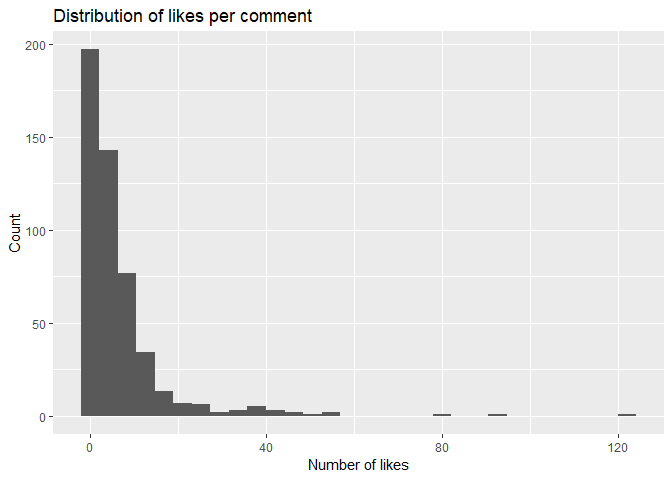

Webtoon Analysis
================
Bryce Wong
March 4, 2019

### Exploratory analysis of the Webtoon Comment data

First reading in the data:

``` r
webtoons_data = read_csv(file = "./data/comments.csv")
```

    ## Warning: Missing column names filled in: 'X1' [1]

    ## Parsed with column specification:
    ## cols(
    ##   X1 = col_integer(),
    ##   episode = col_character(),
    ##   comment_txt = col_character(),
    ##   username = col_character(),
    ##   likes = col_integer(),
    ##   reply = col_logical(),
    ##   likes_per_ep = col_integer()
    ## )

``` r
webtoons_data = webtoons_data %>% 
  filter(username != "TESTED @YGetIt on IG") %>% 
  select(-X1)
```

Now getting the number of comments per each episode:

-   Outputting table of top 10 episodes by number of comments

``` r
#number of comments per each episode
num_eps = webtoons_data %>%
  count(episode) %>% 
  arrange(desc(n))

#outputting table of top 10 episodes by number of comments
num_eps %>% 
  top_n(10) %>% 
  rename(number_of_comments = n) %>% 
  knitr::kable(digits = 3)
```

    ## Selecting by n

| episode                  |  number\_of\_comments|
|:-------------------------|---------------------:|
| WORLD AIDS DAY!!!        |                    26|
| Heck of a Start          |                    25|
| Brunchy Brunch           |                    21|
| Sometimes People SUCK!!! |                    18|
| FIGHT!!!!                |                    17|
| HAPPY NEW YEAR!!!!!      |                    17|
| Prayers                  |                    16|
| This Could Be Bad        |                    16|
| Doctor Visit             |                    15|
| Further South            |                    15|

Now getting the number of likes per each comment:

-   Outputting table of top 10 comments by number of likes

``` r
#arranging comments by likes
arrange_by_likes = webtoons_data %>%
  arrange(desc(likes)) 

#outputting table of top 10 comments by number of likes
head(arrange(webtoons_data, desc(likes)), 10) %>% 
  knitr::kable(digits = 3)
```

| episode                                   | comment\_txt                                                                                                                                       | username             |  likes| reply |  likes\_per\_ep|
|:------------------------------------------|:---------------------------------------------------------------------------------------------------------------------------------------------------|:---------------------|------:|:------|---------------:|
| Heck of a Start                           | i love hamilton reference!                                                                                                                         | sub<U+270C>pewds     |    122| FALSE |             523|
| Heck of a Start                           | omg is that a-aron burr                                                                                                                            | saphirefan666        |     91| FALSE |             523|
| Heck of a Start                           | Hamilton :^))                                                                                                                                      | swirlixpuff          |     81| FALSE |             523|
| Solution or More Problems?                | I'm glad she was able to accept his help even if she can't forgive him. Please don't screw it up, dude. This is your last chance.                  | frowsy               |     57| FALSE |             204|
| This Could Be Bad                         | SHE HAD ONE DAMN JOB                                                                                                                               | GrimmZin             |     55| FALSE |             235|
| You Just Gonna Put My Business Out There? | Clearly tact and regard for patience privacy aren't a concern for this nurse. Fire her.                                                            | coyowolf TMT         |     53| FALSE |             238|
| Brunchy Brunch                            | wait what...... what kinda crazy person just goes: HEY LET'S RAISE OUR FRIEND'S BROTHER!! WHEEE!!                                                  | happycat(:           |     49| FALSE |             296|
| WORLD AIDS DAY!!!                         | honestly this is my new favorite comic it talks about real stuff in the world and i love it.                                                       | just your avrageweeb |     47| FALSE |             278|
| Brunchy Brunch                            | There will be no hood-rat code-switching to improper English at brunch, young lady. Sounds like my dad.                                            | gilleanfryingpan     |     43| FALSE |             296|
| WORLD AIDS DAY!!!                         | Thanks to Featured, I discovered this comic and I love it! Keep up the amazing work, author, and keep on being realistic with the topics! <U+2764> | Gabby Gonzalez       |     40| FALSE |             278|

Now getting the number of comments per each unique user:

-   Outputting table of top 10 users by number of comments

``` r
#number of comments each unique user has posted
num_users = webtoons_data %>%
  count(username) %>% 
  arrange(desc(n)) 

#outputting table of top 10 users by number of comments
#cannot output as a nice table, possibly because a user has UTF8 characters in their name
num_users %>% 
  top_n(10) %>% 
  rename(number_of_comments = n) 
```

    ## Selecting by n

    ## # A tibble: 11 x 2
    ##    username                   number_of_comments
    ##    <chr>                                   <int>
    ##  1 gilleanfryingpan                           45
    ##  2 Kyle Majerczyk                             19
    ##  3 happycat(:                                 18
    ##  4 AoiYeyi                                    17
    ##  5 19danny15                                  16
    ##  6 Cheapthrill_Xo                             15
    ##  7 CopperMortar                               14
    ##  8 catberra                                   12
    ##  9 neftana23                                  11
    ## 10 "\xb0\x95Mariella\x95\xb0"                 10
    ## 11 RedtheGreyFox                              10

Now a bunch of tables showing basic summary statistics for:

-   comments across all episodes
-   comments across all users
-   likes across all comments

Also, one histogram at the end to show the distribution of likes.

(The histogram of the distribution of number of comments per episode was a bit funky and probably not worth viewing)

``` r
#stats of comments across all episodes
avg_num_comm = num_eps %>%
  summarize(mean_comments_per_ep = mean(n),
            median_comments_per_ep = median(n),
            sd_comments = sd(n)) %>% 
  knitr::kable(digits = 3)

avg_num_comm
```

|  mean\_comments\_per\_ep|  median\_comments\_per\_ep|  sd\_comments|
|------------------------:|--------------------------:|-------------:|
|                   10.681|                         10|         5.247|

``` r
#stats of commentators
avg_user = num_users %>%
  summarize(mean_comments_per_user = mean(n),
            median_comments_per_user = median(n),
            sd_comments = sd(n)) %>% 
  knitr::kable(digits = 3)

avg_user
```

|  mean\_comments\_per\_user|  median\_comments\_per\_user|  sd\_comments|
|--------------------------:|----------------------------:|-------------:|
|                      2.773|                            1|         4.621|

``` r
#stats of likes
avg_likes = webtoons_data %>%
  summarize(mean_likes_per_comment = mean(likes),
            median_likes_per_comment = median(likes),
            sd_likes = sd(likes)) %>% 
  knitr::kable(digits = 3)

avg_likes
```

|  mean\_likes\_per\_comment|  median\_likes\_per\_comment|  sd\_likes|
|--------------------------:|----------------------------:|----------:|
|                       6.96|                            4|     11.118|

``` r
#stats of total comment likes
avg_total_likes = webtoons_data %>%
  group_by(episode) %>% 
  summarise(likes = sum(likes)) %>% 
  summarize(mean_total_likes = mean(likes),
            median_total_likes = median(likes),
            sd_total_likes = sd(likes)) %>% 
  knitr::kable(digits = 3)

avg_total_likes
```

|  mean\_total\_likes|  median\_total\_likes|  sd\_total\_likes|
|-------------------:|---------------------:|-----------------:|
|               74.34|                    55|            65.455|

``` r
#stats of likes per episode (likes of episode - NOT comments)
avg_likes_per_ep = webtoons_data %>%
  distinct(episode, .keep_all = TRUE) %>% 
  summarize(mean_likes_per_ep = mean(likes_per_ep),
            median_likes_per_comment = median(likes_per_ep),
            sd_likes = sd(likes_per_ep)) %>% 
  knitr::kable(digits = 3) 

avg_likes_per_ep
```

|  mean\_likes\_per\_ep|  median\_likes\_per\_comment|  sd\_likes|
|---------------------:|----------------------------:|----------:|
|               237.191|                          235|       69.8|

``` r
#visualizations

#distribution of likes
ggplot(webtoons_data, aes(x = likes)) + 
  geom_histogram() + 
  labs(
    title = "Distribution of likes per comment",
    x = "Number of likes",
    y = "Count"
  )
```

    ## `stat_bin()` using `bins = 30`. Pick better value with `binwidth`.



### Sentiment analysis

Note: a lot of the code here is adapted from Jeff Goldsmith's TidyText [lecture](%22http://p8105.com/tidy_text.html%22).

``` r
webtoon_comments = 
  webtoons_data %>%
  mutate(comment_num = row_number(),
         like_category = cut(likes, breaks = c(-Inf, 4, 10, Inf),
                      labels = c("low","middle","high"))) %>% 
  as_tibble() 

data(stop_words)

comment_words = 
  webtoon_comments %>% 
  unnest_tokens(word, comment_txt) %>% 
  anti_join(stop_words)
```

    ## Joining, by = "word"

``` r
comment_word_sentiments <- comment_words %>% 
  inner_join(get_sentiments("bing")) %>% 
  count(comment_num, sentiment) %>% 
  spread(sentiment, n, fill = 0) %>% 
  mutate(sentiment = positive - negative) %>% 
  left_join(webtoon_comments)
```

    ## Joining, by = "word"

    ## Joining, by = "comment_num"

``` r
ggplot(comment_word_sentiments, 
       aes(x = reorder(comment_num, -sentiment), 
           y = sentiment, fill = like_category, color = like_category)) + 
  geom_bar(stat = "identity") + 
  theme(axis.title.x = element_blank(),
        axis.text.x = element_blank(),
        axis.ticks.x = element_blank()) 
```


Most positive comment:

``` r
comment_word_sentiments %>%
  filter(sentiment == max(sentiment)) %>% 
  pull(comment_txt)
```

    ## [1] "Thank you so much notgaybutnot straight thank you for listening so wish I can say everything else had a happy ending but it<U+0092>s okay because people like you make this life thing so much easier esp with the love and support happy New Years to you and yours may god bless you in a bundance<U+2728>"

Most negative comment:

``` r
comment_word_sentiments %>%
  filter(sentiment == min(sentiment)) %>% 
  pull(comment_txt)
```

    ## [1] "When I say all of us I mean yes I was an addict and still am I have an addictive personality thingy, (so I<U+0092>m not living in active addiction anymore) i wish I could like sacrifice myself for all the addicts hurting abused children, & the animals ever poor baby that<U+0092>s getting abused or is sad or anything but sadly I<U+0092>m nobody and I can<U+0092>t change any of it but maybe if I think like this maybe I<U+0092>m not the only one and maybe all of us who feel this way can get together and maybe help all those who are"

Interestingly, cannot find the text for the comment with the lowest/highest sentiment in a specific like\_category - something to look into in the future.

Exporting a text file of the comments:

``` r
just_comments = webtoons_data %>%
  filter(username != "TESTED @YGetIt on IG") %>% 
  select(comment_txt)

write.table(just_comments, file = "just_comments.txt", sep = ",", quote = TRUE, row.names = F)
```
