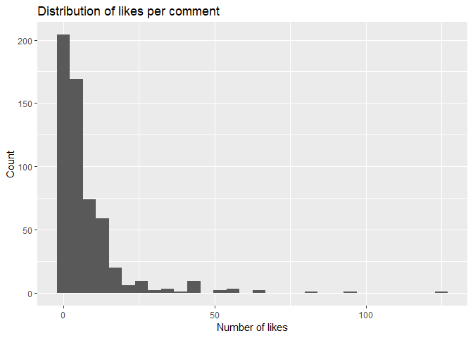
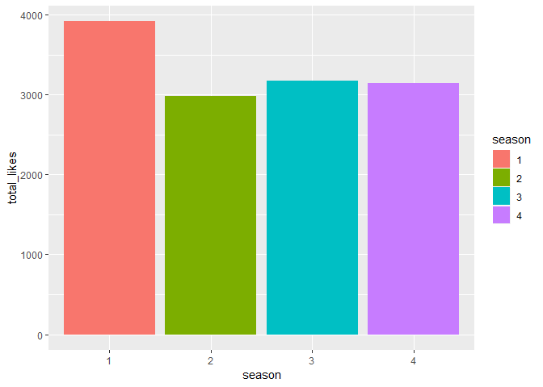
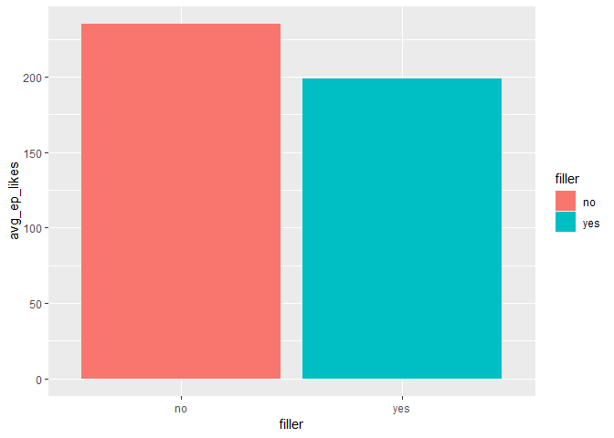
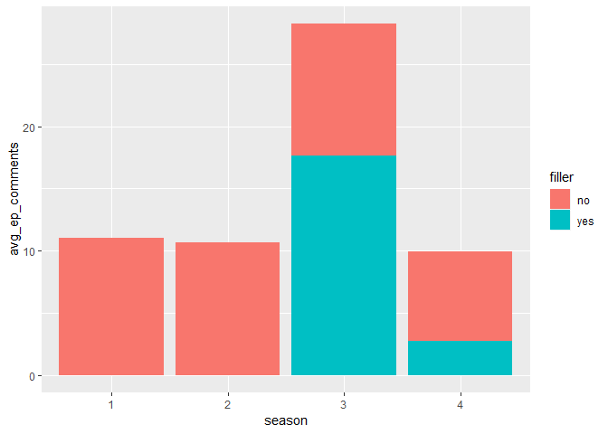

Webtoon Analysis
================
Bryce Wong
May 14, 2019

### Exploratory analysis of the Webtoon Comment data

First reading in the data (updated as of May 10, 2019 - this was run BEFORE episode \#55 had been posted):

``` r
webtoons_data = read_csv(file = "./data/comments_june_12.csv")
```

    ## Warning: Missing column names filled in: 'X1' [1]

    ## Parsed with column specification:
    ## cols(
    ##   X1 = col_integer(),
    ##   episode_num = col_character(),
    ##   episode = col_character(),
    ##   comment_txt = col_character(),
    ##   username = col_character(),
    ##   likes = col_integer(),
    ##   reply = col_logical(),
    ##   likes_per_ep = col_integer()
    ## )

``` r
webtoons_data = webtoons_data %>% 
  filter(username != "TESTED @YGetIt on IG") %>% 
  select(-X1) %>% 
  mutate(
    episode_num = str_replace(episode_num, "#", ""),
    episode_num = as.numeric(episode_num),
    season = ifelse(episode_num %in% 1:12, "1",
                    ifelse(episode_num %in% 13:24, "2",
                           ifelse(episode_num %in% 25:37, "3", "4")))
  )

number_of_eps = webtoons_data %>%
  distinct(episode, .keep_all = TRUE)
```

The total number of comments is 566.

The total number of episodes is 57.

Now getting the number of comments per each episode:

-   Outputting table of top 10 episodes by number of comments

``` r
#number of comments per each episode
num_eps = webtoons_data %>%
  count(episode) %>% 
  arrange(desc(n))

#outputting table of top 10 episodes by number of comments
num_eps %>% 
  top_n(10) %>% 
  rename(number_of_comments = n) %>% 
  knitr::kable(digits = 3)
```

    ## Selecting by n

| episode                  |  number\_of\_comments|
|:-------------------------|---------------------:|
| WORLD AIDS DAY!!!        |                    26|
| Heck of a Start          |                    24|
| Brunchy Brunch           |                    20|
| Sometimes People SUCK!!! |                    18|
| This Could Be Bad        |                    18|
| FIGHT!!!!                |                    17|
| HAPPY NEW YEAR!!!!!      |                    17|
| Doctor Visit             |                    16|
| Prayers                  |                    16|
| Further South            |                    15|

Now getting the number of likes per each comment:

-   Outputting table of top 10 comments by number of likes (couldn't produce a pretty table)

``` r
#arranging comments by likes
arrange_by_likes = webtoons_data %>%
  arrange(desc(likes)) 

#outputting table of top 10 comments by number of likes
head(arrange(webtoons_data, desc(likes)), 10) 
```

    ## # A tibble: 10 x 8
    ##    episode_num episode comment_txt userna~ likes reply likes_per_ep season
    ##          <dbl> <chr>   <chr>       <chr>   <int> <lgl>        <int> <chr> 
    ##  1           1 Heck o~ i love ham~ sub<U+~   125 FALSE          545 1     
    ##  2           1 Heck o~ omg is tha~ saphir~    93 FALSE          545 1     
    ##  3           1 Heck o~ Hamilton :~ swirli~    82 FALSE          545 1     
    ##  4          40 Soluti~ I'm glad s~ frowsy     66 FALSE          221 4     
    ##  5          23 This C~ SHE HAD ON~ GrimmZ~    65 FALSE          248 2     
    ##  6          30 You Ju~ Clearly ta~ coyowo~    58 FALSE          251 3     
    ##  7           6 Brunch~ wait what.~ happyc~    57 FALSE          312 1     
    ##  8          50 Tragedy "This one ~ pompou~    54 FALSE          152 4     
    ##  9           6 Brunch~ There will~ gillea~    51 FALSE          312 1     
    ## 10          32 WORLD ~ honestly t~ just y~    51 FALSE          291 3

Now getting the number of comments per each unique user:

-   Outputting table of top 10 users by number of comments

``` r
#number of comments each unique user has posted
num_users = webtoons_data %>%
  count(username) %>% 
  arrange(desc(n)) 

#outputting table of top 10 users by number of comments
#cannot output as a nice table, possibly because a user has UTF8 characters in their name
num_users %>% 
  top_n(10) %>% 
  rename(number_of_comments = n) 
```

    ## Selecting by n

    ## # A tibble: 12 x 2
    ##    username                   number_of_comments
    ##    <chr>                                   <int>
    ##  1 gilleanfryingpan                           45
    ##  2 AoiYeyi                                    22
    ##  3 sausage172000                              22
    ##  4 happycat(:                                 18
    ##  5 19danny15                                  16
    ##  6 Cheapthrill_Xo                             16
    ##  7 CopperMortar                               14
    ##  8 "\xb0\x95Mariella\x95\xb0"                 13
    ##  9 catberra                                   12
    ## 10 "Johnna\x92s Way"                          12
    ## 11 Mugly Mae                                  12
    ## 12 RedtheGreyFox                              12

-   Outputting table of top 10 episodes by number of episode likes

``` r
#stats of likes per episode (likes of episode - NOT comments)
ep_likes = webtoons_data %>%
  distinct(episode, .keep_all = TRUE)

#removing other columns
ep_likes = ep_likes %>% 
  select(episode, likes_per_ep)

#outputting table of top 10 comments by number of likes
head(arrange(ep_likes, desc(likes_per_ep)), 10) %>% 
  knitr::kable(digits = 3)
```

| episode                      |  likes\_per\_ep|
|:-----------------------------|---------------:|
| Heck of a Start              |             545|
| Uh oh                        |             439|
| Flash Back                   |             373|
| Doctor Visit                 |             342|
| Work It Out                  |             338|
| Brunchy Brunch               |             312|
| WORLD AIDS DAY!!!            |             291|
| Rough Start                  |             282|
| It Goes Down in the Bathroom |             270|
| Ape S\#$%                    |             265|

Now a bunch of tables showing basic summary statistics for:

-   comments across all episodes
-   comments across all users
-   likes across all comments

Also, one histogram at the end to show the distribution of likes.

(The histogram of the distribution of number of comments per episode was a bit funky and probably not worth viewing)

``` r
#stats of comments across all episodes
avg_num_comm = num_eps %>%
  summarize(mean_comments_per_ep = mean(n),
            median_comments_per_ep = median(n),
            sd_comments = sd(n)) %>% 
  knitr::kable(digits = 3)

avg_num_comm
```

|  mean\_comments\_per\_ep|  median\_comments\_per\_ep|  sd\_comments|
|------------------------:|--------------------------:|-------------:|
|                     9.93|                          8|         5.321|

``` r
#stats of commentators
avg_user = num_users %>%
  summarize(mean_comments_per_user = mean(n),
            median_comments_per_user = median(n),
            sd_comments = sd(n)) %>% 
  knitr::kable(digits = 3)

avg_user
```

|  mean\_comments\_per\_user|  median\_comments\_per\_user|  sd\_comments|
|--------------------------:|----------------------------:|-------------:|
|                      2.903|                            1|         4.786|

``` r
#stats of likes
avg_likes = webtoons_data %>%
  summarize(mean_likes_per_comment = mean(likes),
            median_likes_per_comment = median(likes),
            sd_likes = sd(likes)) %>% 
  knitr::kable(digits = 3)

avg_likes
```

|  mean\_likes\_per\_comment|  median\_likes\_per\_comment|  sd\_likes|
|--------------------------:|----------------------------:|----------:|
|                      7.528|                            4|     11.785|

``` r
#stats of total comment likes
avg_total_likes = webtoons_data %>%
  group_by(episode) %>% 
  summarise(likes = sum(likes)) %>% 
  summarize(mean_total_likes = mean(likes),
            median_total_likes = median(likes),
            sd_total_likes = sd(likes)) %>% 
  knitr::kable(digits = 3)

avg_total_likes
```

|  mean\_total\_likes|  median\_total\_likes|  sd\_total\_likes|
|-------------------:|---------------------:|-----------------:|
|              74.754|                    57|            66.136|

``` r
#stats of likes per episode (likes of episode - NOT comments)
avg_likes_per_ep = webtoons_data %>%
  distinct(episode, .keep_all = TRUE) %>% 
  summarize(mean_likes_per_ep = mean(likes_per_ep),
            median_likes_per_ep = median(likes_per_ep),
            sd_likes = sd(likes_per_ep)) %>% 
  knitr::kable(digits = 3) 

avg_likes_per_ep
```

|  mean\_likes\_per\_ep|  median\_likes\_per\_ep|  sd\_likes|
|---------------------:|-----------------------:|----------:|
|               231.877|                     245|     78.863|

``` r
#visualizations

#distribution of likes
ggplot(webtoons_data, aes(x = likes)) + 
  geom_histogram() + 
  labs(
    title = "Distribution of likes per comment",
    x = "Number of likes",
    y = "Count"
  )
```

    ## `stat_bin()` using `bins = 30`. Pick better value with `binwidth`.



### Descriptive Statistics By Season

Creating a variable that organizes the episodes by season - note that this code will not be extendable to organizing future episodes by season (there is no "season" identification marker built into the way the episodes were uploaded to Webtoons).

The assignment of an episode to a specific season had to be done by hand, by taking a look at the titles and figuring out which season they belong to.

Note that not all seasons have the same number of episodes (some seasons have filler episodes) - thus, the average number of likes and comments per an episode in each season have also been calculated.

``` r
seasons = webtoons_data %>% 
  select(season, episode_num, episode, comment_txt, likes_per_ep)

#total episode likes per season
likes_per_season = seasons %>% 
  distinct(episode_num, .keep_all = TRUE) %>% 
  group_by(season) %>% 
  summarize(total_likes = sum(likes_per_ep)) 

likes_per_season %>% 
  knitr::kable(digits = 3) 
```

| season |  total\_likes|
|:-------|-------------:|
| 1      |          3918|
| 2      |          2982|
| 3      |          3176|
| 4      |          3141|

``` r
#visualization
ggplot(likes_per_season, aes(x = season, y = total_likes, fill = season)) + geom_bar(stat = 'identity')
```



``` r
#avg likes per episode by season
avg_ep_likes_season = seasons %>% 
  distinct(episode_num, .keep_all = TRUE) %>% 
  group_by(season) %>% 
  summarize(avg_ep_likes = mean(likes_per_ep)) 

avg_ep_likes_season %>% 
  knitr::kable(digits = 3) 
```

| season |  avg\_ep\_likes|
|:-------|---------------:|
| 1      |         326.500|
| 2      |         248.500|
| 3      |         244.308|
| 4      |         157.050|

``` r
#visualization
ggplot(avg_ep_likes_season, aes(x = season, y = avg_ep_likes, fill = season)) + geom_bar(stat = 'identity')
```


``` r
#total comments per season
comments_per_season = seasons %>% 
  count(season) %>% 
  rename(total_comments = n)

comments_per_season %>% 
  knitr::kable(digits = 3)
```

| season |  total\_comments|
|:-------|----------------:|
| 1      |              132|
| 2      |              128|
| 3      |              159|
| 4      |              147|

``` r
#visualization
ggplot(comments_per_season, aes(x = season, y = total_comments, fill = season)) + geom_bar(stat = 'identity')
```


``` r
#avg comments per episode by season
avg_ep_comments_season = seasons %>% 
  count(season, episode) %>% 
  group_by(season) %>% 
  summarize(avg_ep_comments = mean(n)) 

avg_ep_comments_season %>% 
  knitr::kable(digits = 3)
```

| season |  avg\_ep\_comments|
|:-------|------------------:|
| 1      |             11.000|
| 2      |             10.667|
| 3      |             12.231|
| 4      |              7.350|

``` r
#visualization
ggplot(avg_ep_comments_season, aes(x = season, y = avg_ep_comments, fill = season)) + geom_bar(stat = 'identity')
```


### Comparing filler episodes to regular episodes

``` r
#assigning "filler" label to filler episodes
filler_data = seasons %>%  
  mutate(
    filler = ifelse(episode_num %in% 36:38, "yes",
                    ifelse(episode_num == 32, "yes",
                           ifelse(episode_num == 54:57, "yes", "no")))
  )
```

    ## Warning in episode_num == 54:57: longer object length is not a multiple of
    ## shorter object length

``` r
#average comments for filler episodes versus for non-filler episodes
avg_ep_comments_filler = filler_data %>% 
  count(season, episode_num, filler) %>% 
  group_by(filler) %>% 
  summarize(avg_ep_comments = mean(n)) 

avg_ep_comments_filler %>% 
  knitr::kable(digits = 3)
```

| filler |  avg\_ep\_comments|
|:-------|------------------:|
| no     |              9.472|
| yes    |              9.143|

``` r
#visualization
ggplot(avg_ep_comments_filler, aes(x = filler, y = avg_ep_comments, fill = filler)) + geom_bar(stat = 'identity')
```


``` r
#average likes for filler episodes versus for non-filler episodes
avg_ep_likes_filler = filler_data %>% 
  distinct(episode_num, .keep_all = TRUE) %>% 
  group_by(filler) %>% 
  summarize(avg_ep_likes = mean(likes_per_ep)) 

avg_ep_likes_filler %>% 
  knitr::kable(digits = 3) 
```

| filler |  avg\_ep\_likes|
|:-------|---------------:|
| no     |         235.077|
| yes    |         198.600|

``` r
#visualization
ggplot(avg_ep_likes_filler, aes(x = filler, y = avg_ep_likes, fill = filler)) + geom_bar(stat = 'identity')
```



``` r
#average comments by season, filler vs non-filler
avg_comments_filler_season = filler_data %>% 
  count(season, episode_num, filler) %>% 
  group_by(season, filler) %>% 
  summarize(avg_ep_comments = mean(n)) 

avg_comments_filler_season %>% 
  knitr::kable(digits = 3)
```

| season | filler |  avg\_ep\_comments|
|:-------|:-------|------------------:|
| 1      | no     |             11.000|
| 2      | no     |             10.667|
| 3      | no     |             10.600|
| 3      | yes    |             17.667|
| 4      | no     |              7.158|
| 4      | yes    |              2.750|

``` r
#visualization
ggplot(avg_comments_filler_season, aes(x = season, y = avg_ep_comments, fill = filler)) + geom_bar(stat = 'identity')
```



``` r
#average likes by season, filler vs non-filler
avg_likes_filler_season = filler_data %>% 
  distinct(episode_num, .keep_all = TRUE) %>% 
  group_by(season, filler) %>% 
  summarize(avg_ep_likes = mean(likes_per_ep)) 

avg_likes_filler_season %>% 
  knitr::kable(digits = 3) 
```

| season | filler |  avg\_ep\_likes|
|:-------|:-------|---------------:|
| 1      | no     |         326.500|
| 2      | no     |         248.500|
| 3      | no     |         249.400|
| 3      | yes    |         227.333|
| 4      | no     |         157.222|
| 4      | yes    |         155.500|

``` r
#visualization
ggplot(avg_likes_filler_season, aes(x = season, y = avg_ep_likes, fill = filler)) + geom_bar(stat = 'identity')
```


### Comparing health messaging episodes to all other episodes

Be aware that the labelling of health messaging episodes is hardcoded - to update this code for later scraping, you need to update the episodes included as health messaging.

``` r
#assigning "health" label to health messaging episodes
health_data = seasons %>%  
  mutate(
    health = ifelse(episode_num %in% 54:56, "yes",
                ifelse(episode_num == 51, "yes",
                    ifelse(episode_num == 32, "yes", "no")))
  )

#average comments for health messaging episodes versus for all other episodes
avg_ep_comments_health = health_data %>% 
  count(season, episode_num, health) %>% 
  group_by(health) %>% 
  summarize(avg_ep_comments = mean(n)) 

avg_ep_comments_health %>% 
  knitr::kable(digits = 3)
```

| health |  avg\_ep\_comments|
|:-------|------------------:|
| no     |             10.173|
| yes    |              7.400|

``` r
#visualization
ggplot(avg_ep_comments_health, aes(x = health, y = avg_ep_comments, fill = health)) + geom_bar(stat = 'identity')
```


``` r
#average likes for health messaging episodes versus for all other episodes
avg_ep_likes_health = health_data %>% 
  distinct(episode_num, .keep_all = TRUE) %>% 
  group_by(health) %>% 
  summarize(avg_ep_likes = mean(likes_per_ep)) 

avg_ep_likes_health %>% 
  knitr::kable(digits = 3) 
```

| health |  avg\_ep\_likes|
|:-------|---------------:|
| no     |         239.192|
| yes    |         155.800|

``` r
#visualization
ggplot(avg_ep_likes_health, aes(x = health, y = avg_ep_likes, fill = health)) + geom_bar(stat = 'identity')
```


### Sentiment analysis

Note: a lot of the code here is adapted from Jeff Goldsmith's TidyText [lecture](%22http://p8105.com/tidy_text.html%22).

``` r
webtoon_comments = 
  webtoons_data %>%
  mutate(comment_num = row_number(),
         like_category = cut(likes, breaks = c(-Inf, 4, 10, Inf),
                      labels = c("low","middle","high"))) %>% 
  as_tibble() 

data(stop_words)

comment_words = 
  webtoon_comments %>% 
  unnest_tokens(word, comment_txt) %>% 
  anti_join(stop_words)
```

    ## Joining, by = "word"

``` r
comment_word_sentiments <- comment_words %>% 
  inner_join(get_sentiments("bing")) %>% 
  count(comment_num, sentiment) %>% 
  spread(sentiment, n, fill = 0) %>% 
  mutate(sentiment = positive - negative) %>% 
  left_join(webtoon_comments)
```

    ## Joining, by = "word"

    ## Joining, by = "comment_num"

``` r
ggplot(comment_word_sentiments, 
       aes(x = reorder(comment_num, -sentiment), 
           y = sentiment, fill = like_category, color = like_category)) + 
  geom_bar(stat = "identity") + 
  theme(axis.title.x = element_blank(),
        axis.text.x = element_blank(),
        axis.ticks.x = element_blank()) 
```


Most positive comment:

``` r
comment_word_sentiments %>%
  filter(sentiment == max(sentiment)) %>% 
  pull(comment_txt)
```

    ## [1] "Thank you so much notgaybutnot straight thank you for listening so wish I can say everything else had a happy ending but it<U+0092>s okay because people like you make this life thing so much easier esp with the love and support happy New Years to you and yours may god bless you in a bundance<U+2728>"

Most negative comment:

``` r
comment_word_sentiments %>%
  filter(sentiment == min(sentiment)) %>% 
  pull(comment_txt)
```

    ## [1] "When I say all of us I mean yes I was an addict and still am I have an addictive personality thingy, (so I<U+0092>m not living in active addiction anymore) i wish I could like sacrifice myself for all the addicts hurting abused children, & the animals ever poor baby that<U+0092>s getting abused or is sad or anything but sadly I<U+0092>m nobody and I can<U+0092>t change any of it but maybe if I think like this maybe I<U+0092>m not the only one and maybe all of us who feel this way can get together and maybe help all those who are"

Interestingly, cannot find the text for the comment with the lowest/highest sentiment in a specific like\_category - something to look into in the future.

Exporting a text file of the comments (commented out for now):

``` r
#just_comments = webtoons_data %>%
  #filter(username != "TESTED @YGetIt on IG") %>% 
  #select(comment_txt)

#write.table(just_comments, file = "just_comments.txt", sep = ",", quote = TRUE, row.names = F)
```
